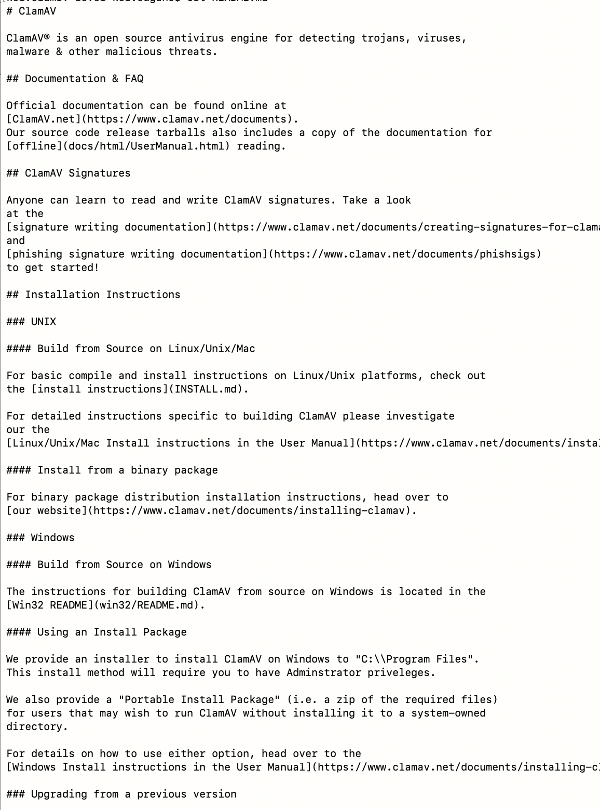
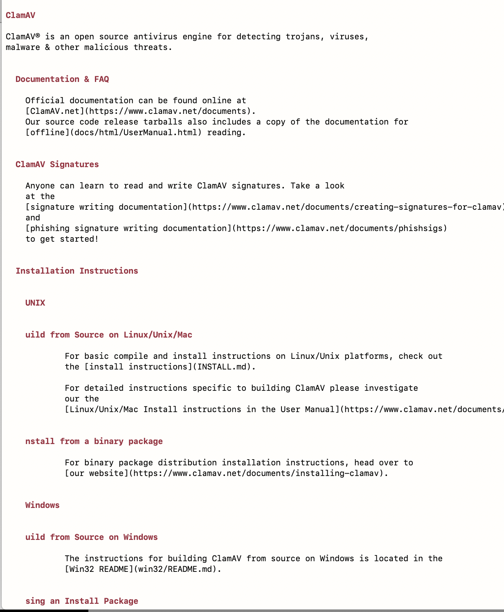

# This is markdown viewer on terminal

## prerequisites

- python 3.x

## installation

```
./scripts/installer
```

## usage

```
$ sugamd [target markdown file path]
```

basically, without any arguments, it will try to read `README.md` of your current workdir.

**here is the sample original markdown:**


**after sugamd applied:**



## TODO:

table interpretation

